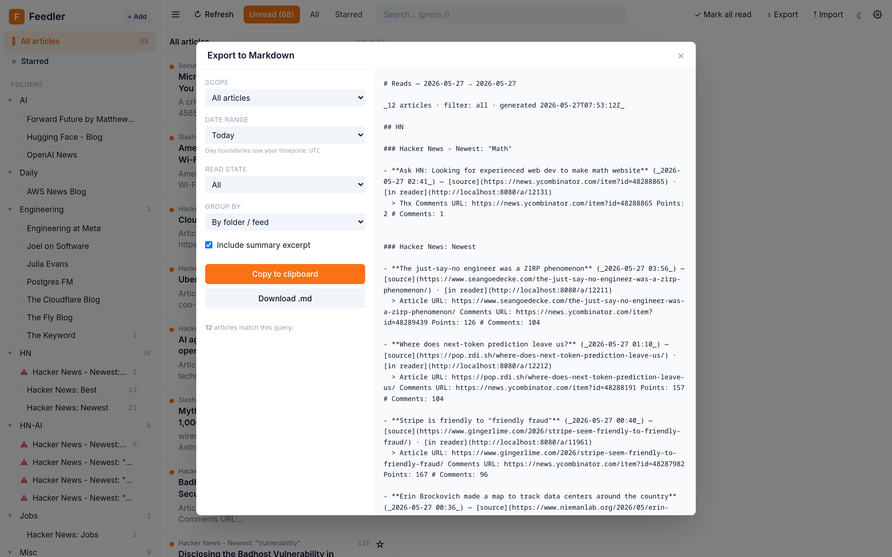
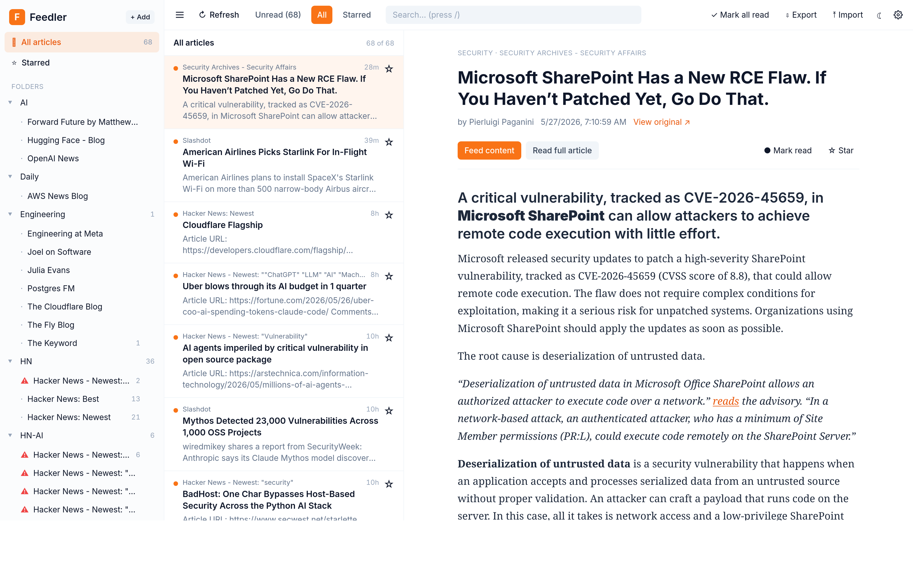
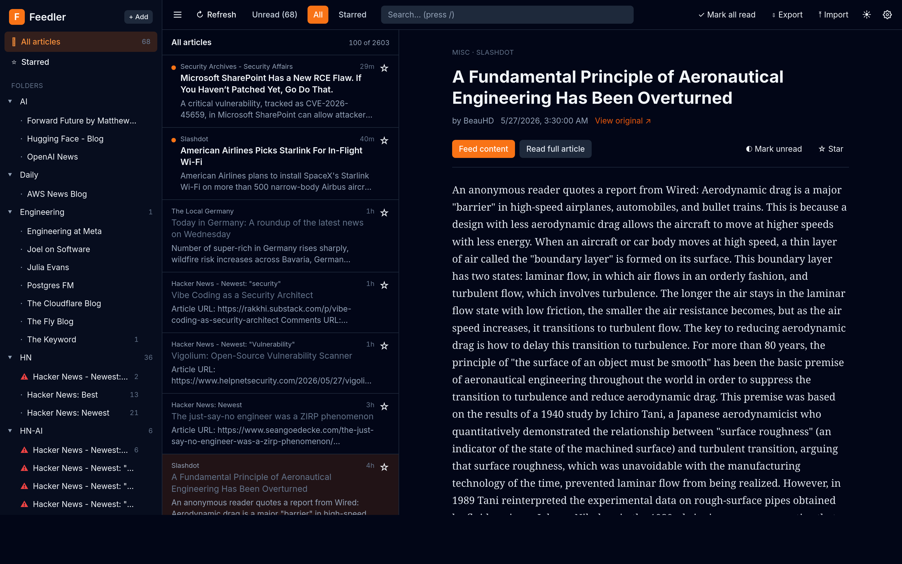

# Feedler

A self-hosted RSS/Atom reader built around one idea: **triage your feeds here,
then export your reads as Markdown and hand them to an AI.** Rather than bolting
a chatbot onto the reader, Feedler lets you export *Today* / *This Week* (or any
range/folder/feed) as clean Markdown — with a link back to the **original
article** *and* a link to the item **in Feedler** — to drop into Claude, ChatGPT,
or any LLM for summarizing, clustering, and triage.

Single Go binary with an embedded React frontend, one port, one `docker compose up`.

### The point: export your reads for an AI



### A fast, keyboard-driven reader to get you there



<sub>Light & dark themes · three-pane Reeder-style layout · full-article reading · read-on-scroll.</sub>



## Features

- **Web-based**, three-pane Reeder-style UI (folders → list → reader)
- **Single port** (8080) — Go serves the API *and* the bundled React app
- **Single container** brought up by `docker compose up`
- **No auth** — local single-user
- **Read / unread / starred** state, per-feed and per-folder unread counts
- **OPML import** (seeded automatically from `./Feeds.opml` on first run, or
  upload via the UI)
- **Per-article toggle** between *Feed content* and *Read full article*
  (Mozilla-readability extraction, cached in SQLite)
- **Markdown export** for "Today", "Yesterday", "Last 7 days", "Last 30 days",
  "All time", or custom date range. Filter by read/unread/starred. Group by
  feed or chronologically. **Every entry includes both the original URL and a
  back-link into Feedler (`/a/<id>`)** so an LLM can cite either.
- **Auto-refresh** every 30 min (configurable), plus manual refresh
- **Keyboard shortcuts**: `j`/`k` next/prev, `m` toggle read, `s` star,
  `o` open original, `r` refresh, `e` export, `/` search
- **Dark mode**, follows system preference

## Quick start

```bash
docker compose up --build
# then open http://localhost:8080
```

The first run will:

1. Create `./data/feedler.db` (SQLite)
2. Import the feeds from `./Feeds.opml`
3. Trigger an initial refresh

## How the AI export works

Click **⇩ Export** (or press `e`). Pick a range, filter, and grouping; copy to
clipboard or download the `.md`. Paste it into Claude / ChatGPT / your local
LLM with a prompt like:

> Summarize today's reads. Cluster by theme, highlight 5 things worth my
> attention, and link back to the originals.

Each item in the export looks like:

```markdown
- **GPT-5 launches** (_2026-05-26 14:22_) — [source](https://openai.com/...) · [in reader](http://localhost:8080/a/123)
  > Short summary excerpt…
```

- `source` → the article on the publisher's site
- `in reader` → opens Feedler with that article focused

## Configuration

All optional, set in `docker-compose.yml`:

| Var | Default | What |
|---|---|---|
| `FEEDLER_PUBLIC_BASE_URL` | `http://localhost:8080` | Used for the "in reader" links in exports |
| `FEEDLER_REFRESH_INTERVAL_MINUTES` | `30` | Background refresh cadence |
| `FEEDLER_PORT` | `8080` | HTTP port inside the container |
| `FEEDLER_DATA_DIR` | `/data` | SQLite location inside the container |
| `FEEDLER_SEED_OPML` | `/seed/Feeds.opml` | Imported on first run if present |

## Development

No local tooling needed — everything builds inside Docker:

```bash
docker compose up --build       # rebuild on changes
docker compose down             # stop
docker compose down -v          # stop + delete data
```

When you edit code, just re-run `docker compose up --build`. The build is
cached aggressively (Go module cache, Go build cache, npm cache via BuildKit
mounts), so incremental rebuilds are quick.

### Layout

```
backend/
  main.go                          # entrypoint, embeds static/
  internal/
    db/         schema + migrations
    models/     shared structs
    feeds/      OPML parser + fetcher (gofeed, etag/last-modified)
    readability/ full-article extraction
    export/     markdown export
    scheduler/  background refresh loop
    api/        chi routes + handlers
  static/       (populated at build time by the FE stage)
frontend/
  src/
    App.tsx
    api.ts, types.ts
    components/  Sidebar, ArticleList, ArticleView, Toolbar, dialogs
data/           SQLite database (gitignored)
Feeds.opml      seeded on first run
Dockerfile      multi-stage: FE → Go binary with embedded FE → alpine
docker-compose.yml
```

### API

All under `/api`:

| Method | Path | Notes |
|---|---|---|
| GET | `/api/feeds` | folders → feeds with unread counts |
| POST | `/api/feeds/refresh` | kick off refresh of all feeds |
| POST | `/api/feeds/{id}/refresh` | refresh one feed |
| GET | `/api/feeds/refresh-status` | last refresh stats |
| DELETE | `/api/feeds/{id}` | remove a feed |
| GET | `/api/articles?feed=&folder=&filter=&search=&offset=&limit=` | paginated list |
| GET | `/api/articles/{id}` | single article (full record) |
| POST | `/api/articles/{id}/read` / `/unread` / `/star` | state mutations |
| GET | `/api/articles/{id}/full` | run readability, cache, return HTML |
| POST | `/api/articles/mark-all-read` | body `{feed_id?, folder?}` |
| POST | `/api/import` | multipart `file=*.opml` or raw OPML body |
| GET | `/api/export?range=&from=&to=&filter=&group=&body=&disposition=` | Markdown |
| GET | `/a/{id}` | short reader deep-link (redirects to FE) |
